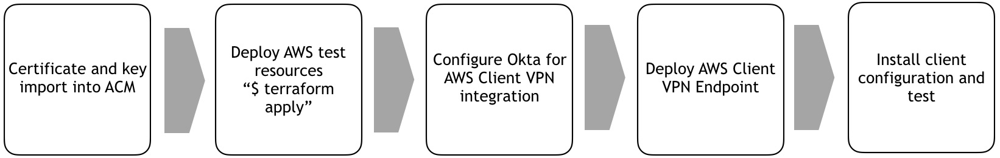

# AWS Client VPN (SAML) Hands-On preparation 

**Difficulty:** Mid

**Scenario goal:**

- AWS Client VPN connected.
- Browse internal website on your browser.

**Command:**
```
$ cd aws-clientvpn-okta/terraform
$ terraform init
$ terraform apply
(once completed)
$ terraform destroy
```

**Resources to be deployed:**

* 1 VPC with:
  * EC2 x 1

## Summary

AWS Client VPN is compatible with SAML integration. In this hands-on, you will deploy a lab resources on your aws environment, and configure aws and IdP(Okta) to setup an authentication.

## Guide chart



## Guide

** detailed guide with screenshot is available on https://shogokobayashi.com/?p=1204 **

1. Generate certificate and key and import them onto ACM.
```
{
git clone https://github.com/OpenVPN/easy-rsa.git
cd easy-rsa/easyrsa3
./easyrsa init-pki
./easyrsa build-ca nopass
./easyrsa build-server-full lab_server nopass
mkdir ~/temp_folder
cp pki/ca.crt ~/temp_folder/
cp pki/issued/lab_server.crt ~/temp_folder/
cp pki/private/lab_server.key ~/temp_folder/
cd ~/temp_folder/
```

2. Apply terraform file and deploy resources on AWS by issueing `$ terraform apply`.

3. Login Okta as an admin. "Create New App" > "AWS ClientVPN" > "Add", and click "Done". In App settings, change below parameters. And download metadata file by clicking "Identity Provider metadata".
> - memberOf: Matches regex, and ".*"
> - dvanced sign-on settings - Port: 35001  

4. Configure AWS Client VPN Endpoint. Once configured download the client config.

5. Install AWS-provided client and install the config you just downloaded.

6. Once the work is completed, delete Client VPN Endpoint.

7. Execute `$ terraform destroy` to delete all test resources from AWS.

6. Login to your aws again and confirm no resources are left not to be deleted.

## Comment
🎉
Conguratulations, you have been configured AWS Client VPN with SAML federation! 
